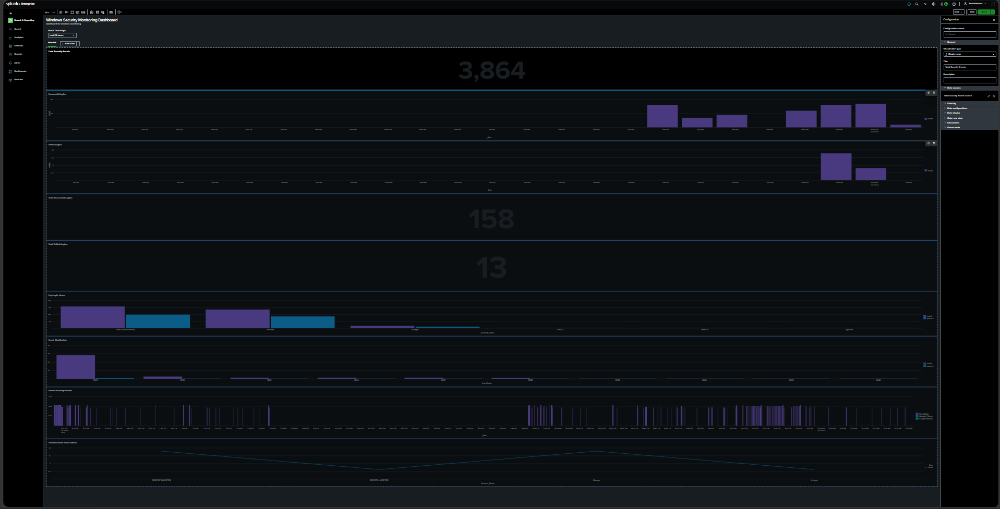
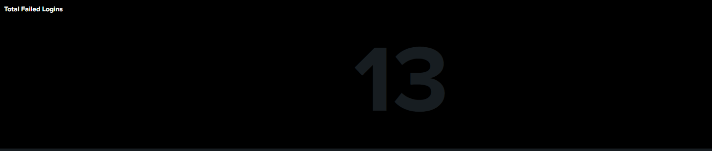
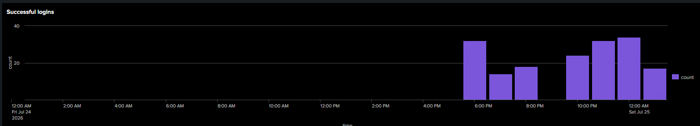
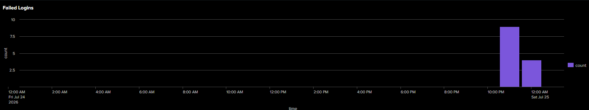
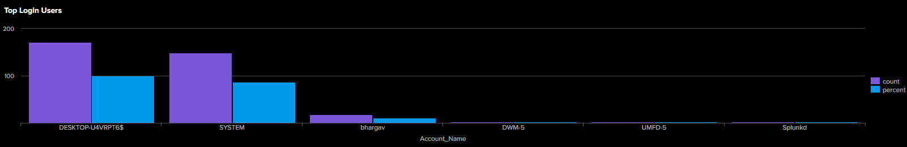
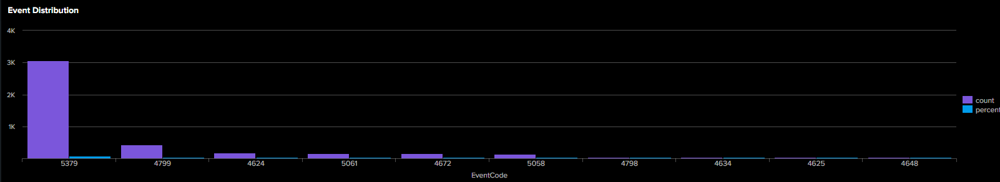
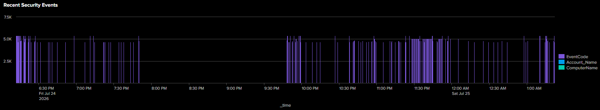
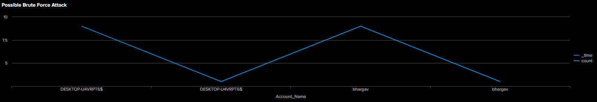

# Windows Security Monitoring Dashboard using Splunk

## Overview

This project demonstrates the use of Splunk Enterprise as a Security Information and Event Management (SIEM) solution for monitoring Windows Security Event Logs. The dashboard provides real-time visibility into authentication events, login trends, security event distribution, and potential brute-force attacks using Search Processing Language (SPL).

---

## Features

- Monitor Windows Security Event Logs
- Track successful and failed logins
- Display total security events
- Visualize login trends over time
- Identify top login users
- Analyze Windows Event ID distribution
- Detect potential brute-force login attempts
- View recent security events

---

## Technologies Used

- Splunk Enterprise 10.4.1
- Search Processing Language (SPL)
- Windows Event Logs
- Windows 11

---

## Dashboard Overview



---

## Dashboard Panels

### Total Security Events


### Total Successful Logins


### Total Failed Logins



### Successful Login Trend



### Failed Login Trend



### Top Login Users



### Event Distribution



### Recent Security Events



### Brute Force Detection



---

## SPL Queries

All SPL queries used to build the dashboard are available in the `spl_queries` folder.

---

## Project Structure

```
Splunk-Windows-Security-Dashboard/
│
├── README.md
├── LICENSE
├── screenshots/
├── spl_queries/
└── report/
```

---

## Future Improvements

- Real-time alerts
- Email notifications
- Scheduled reports
- Threat intelligence integration
- Detection of suspicious PowerShell activity
- Account lockout monitoring

---

## Author

**Bhargav Naidu**

Cybersecurity Student | SOC Analyst Enthusiast